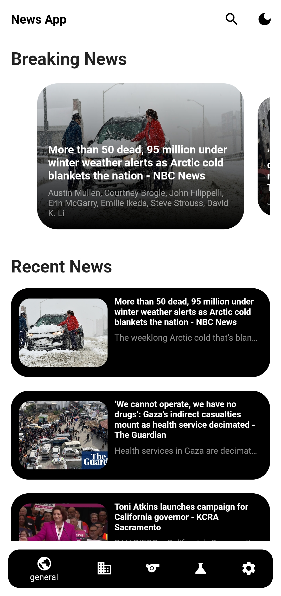

# NewsApp

## Overview

NewsApp is a cross-platform mobile application built using the Flutter framework that leverages the [NewsAPI](https://newsapi.org/) to fetch and display the latest news articles from various sources around the world. This application provides a user-friendly interface for staying informed about current events and breaking news.

## Features

1. **Headlines:** View the top headlines from a variety of news sources.
2. **Categories:** Explore news articles categorized by topics such as business, entertainment, health, science, sports, and technology.

## Technologies Used

- **Flutter:** The application is built using the Flutter framework, enabling a single codebase for both iOS and Android platforms.
- **Dart:** The programming language used for developing the application logic.
- **NewsAPI:** The application fetches real-time news data from the NewsAPI, a comprehensive news aggregator.
- **BIP Library** Bio package dealing with API

## 📸 Screenshots :

